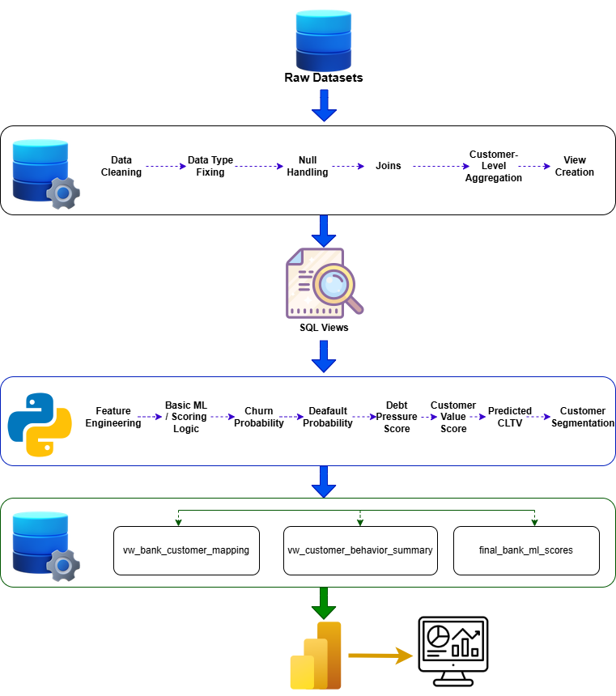
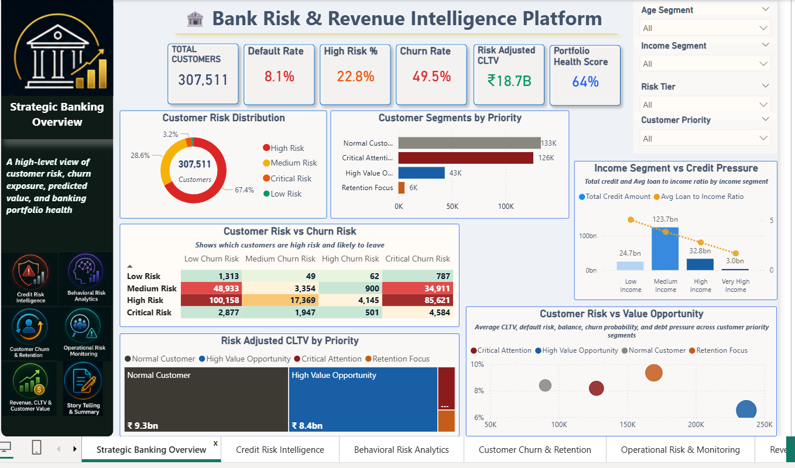
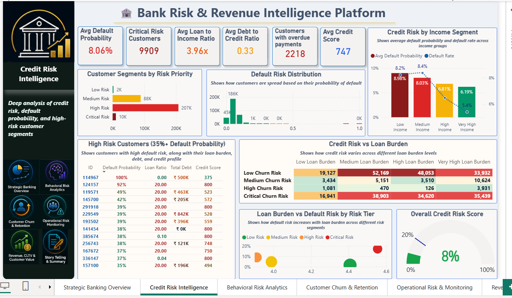
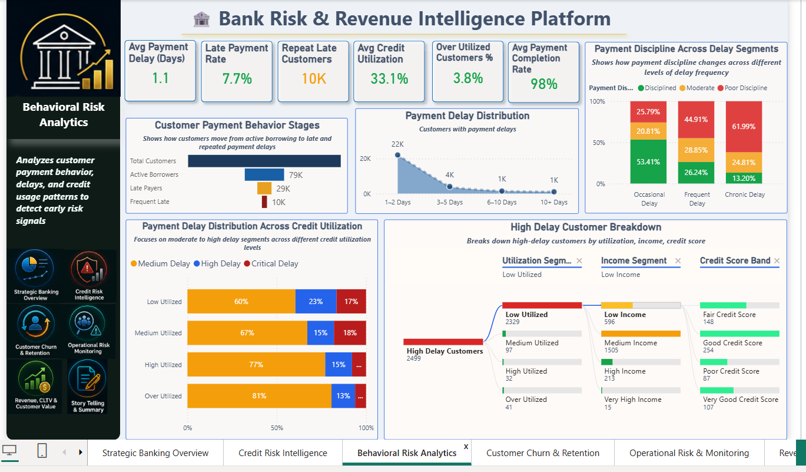
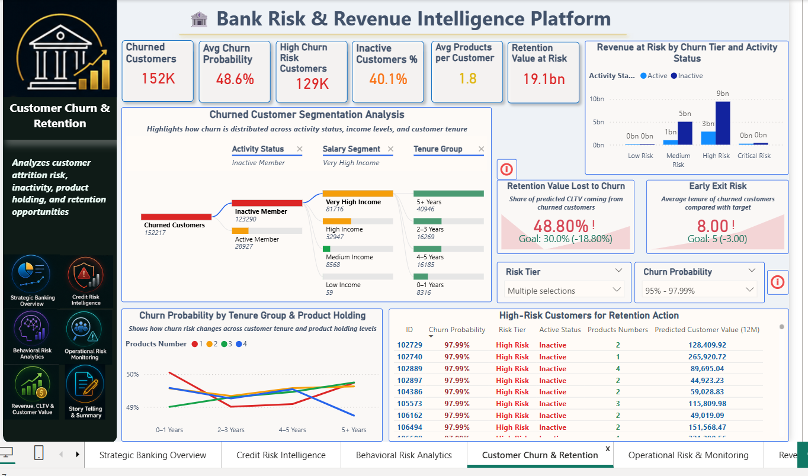
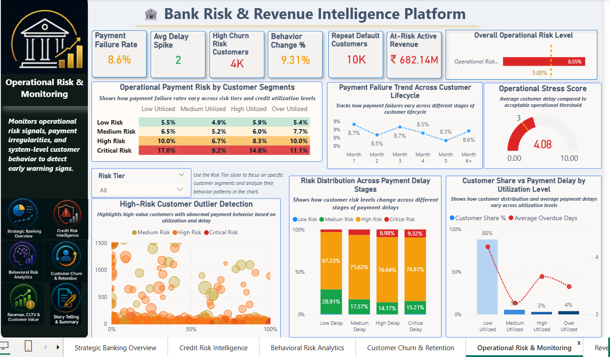
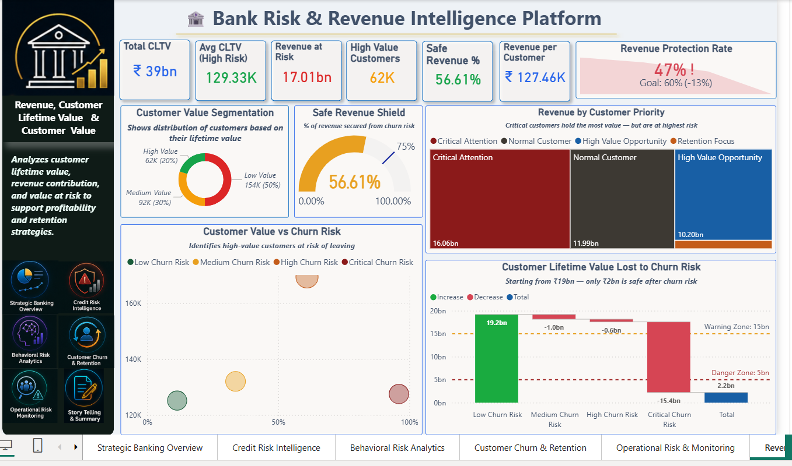
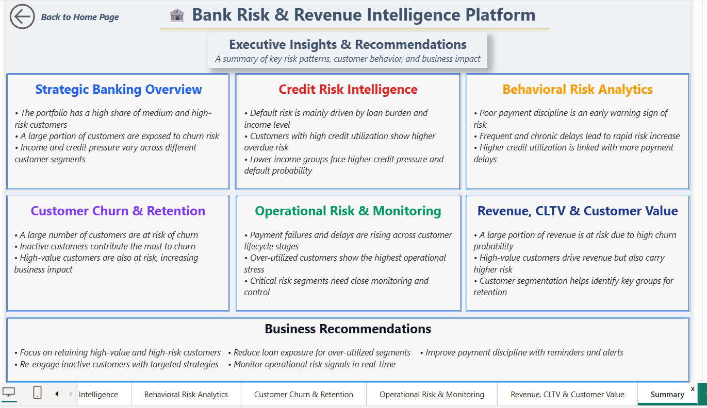

# 🏦 Bank Risk & Revenue Intelligence Platform

This dashboard helps banks identify credit risk, predict churn, monitor operations, and protect revenue.

An end-to-end Business Intelligence project built using:

**SQL → Python → Power BI**

---

## 🔗 Live Dashboard

👉 (Add your Power BI link here)

[View Dashboard](https://app.powerbi.com/links/4p8HkIVi2M?ctid=e66d4a36-e7af-4202-abd5-360d3aa12b25&pbi_source=linkShare)

---

---

## 📌 Project Overview

This project is a complete **Banking Risk Analytics System**.

I started with raw banking datasets (credit risk + customer churn).  
Then I cleaned and transformed the data using SQL Server.  
After that, I used Python for feature engineering and basic machine learning style scoring logic to create churn probability, customer value score, debt pressure score, and predicted CLTV. 
Finally, I built a **Power BI dashboard** to analyze:

- Credit risk  
- Customer behavior  
- Churn probability  
- Operational risk  
- Revenue impact (CLTV)  

---

## 🗂️ Project Workflow

**Raw Data → SQL Cleaning → Python Feature Engineering/Basic ML → Power BI Dashboard**

---

## 🛤️ Project Roadmap

---

## 🛠️ Tools & Technologies

| Tool | Purpose |
|------|--------|
| SQL Server | Data cleaning, joins, views |
| Python | Feature engineering, basic ML scoring, customer segmentation |
| Power BI | Dashboard & visualization |
| Power Query | Minor data transformation |
| DAX | KPI & business calculations |

---

## 📁 Dataset

This project uses two main datasets:

### 1. Credit Risk Dataset
- Customer loan data  
- Income, credit, debt  
- Default target  

### 2. Customer Churn Dataset
- Customer activity  
- Balance, tenure  
- Churn status  

---

## 🔷 Step 1: SQL Work

### What I did in SQL
- Imported multiple raw tables  
- Cleaned null values  
- Fixed data types  
- Handled missing values  
- Removed duplicates  
- Created joins between datasets  

### 🧱 SQL Views Created
- vw_clean_application  
- vw_bureau_customer_summary  
- vw_bank_customer_mapping  

### 📌 Important Columns
- Customer ID  
- Income  
- Credit amount  
- Loan ratio  
- Debt ratio  
- Overdue days  
- Credit utilization  
- Default target  

### 🧮 SQL Calculated Features
- Debt-to-credit ratio  
- Loan-to-income ratio  
- Overdue flags  
- Risk indicators  

---

## 🟡 Step 2: Python Work

### Input
- SQL output (cleaned data)

### Basic ML / Scoring Logic Used

In Python, I used basic machine learning style logic and business rules to create customer-level risk and value scores.

The goal was not only to clean data, but also to create useful predictive features for Power BI analysis.

### ML-Based Features Created

- churn_probability  
- default_probability  
- debt_pressure_score  
- customer_value_score  
- predicted_cltv_12m  
- customer_value_segment  
- churn_risk_tier  
- credit_risk_tier  

These features helped me identify risky customers, high-value customers, churn-prone customers, and revenue at risk.

### Feature Engineering Logic
- Combined income, credit, and behavior  
- Created scoring models  
- Built segmentation (Low / Medium / High / Premium)

### Output
- Final dataset **final_bank_ml_scores** for Power BI  

---

## 🧩 Data Model (Power BI)

### Fact Table
- vw_bank_customer_mapping
- vw_customer_behavior_summary
- final_bank_ml_scores  

### Key Fields
- Customer ID  
- CLTV  
- Churn probability  
- Risk tier  
- Utilization  
- Delay  

---

## 📊 DAX Measures

I created **DAX measures**, including:

- Total Customers  
- Default Rate  
- Churn Rate  
- Risk Adjusted CLTV  
- Revenue at Risk  
- Safe Revenue %  
- Portfolio Health Score  
- Operational Risk Score  

---

# 📊 Dashboard Pages

---

## 🟦 Page 1 — Strategic Banking Overview

**Purpose:**  
High-level summary of customer risk and portfolio health  

**KPIs:**
- Total Customers  
- Default Rate  
- Churn Rate  
- Risk Adjusted CLTV  
- Portfolio Health Score  

---

## 🟥 Page 2 — Credit Risk Intelligence

**Purpose:**  
Analyze loan risk and default drivers  

**Key Insights:**
- Loan burden increases default risk  
- Low income increases credit pressure  

---

## 🟨 Page 3 — Behavioral Risk Analytics

**Purpose:**  
Detect early risk using customer behavior  

**Key Insights:**
- Payment delay increases risk  
- High utilization leads to higher default  

---

## 🟪 Page 4 — Customer Churn & Retention

**Purpose:**  
Identify customers likely to leave  

**Key Insights:**
- Inactive users drive churn  
- High-value customers also at risk  

---

## 🟩 Page 5 — Operational Risk & Monitoring

**Purpose:**  
Monitor payment failures and delays  

**Key Insights:**
- Over-utilized customers have highest stress  
- Delay patterns increase over lifecycle  

---

## 🟦 Page 6 — Revenue, CLTV & Customer Value

**Purpose:**  
Measure business impact and revenue risk  

**Key Insights:**
- Revenue at risk is significant  
- High-value customers are critical  

---

## 🧠 Page 7 — Executive Insights & Recommendations

**Purpose:**  
Convert data into business decisions  

Includes:
- Summary of all pages  
- Key findings  
- Business actions  

---

## 📸 Dashboard Preview

### 🔹 Strategic Banking Overview

### 🔹 Credit Risk Intelligence

### 🔹 Behavioral Risk Analytics

### 🔹 Customer Churn & Retention

### 🔹 Operational Risk & Monitoring

### 🔹 Revenue, CLTV & Customer Value

### 🔹 Executive Insights & Recommendations

---

---

## 💡 Key Business Insights

- High-risk customers impact revenue significantly  
- Loan burden is the main driver of default  
- Behavioral patterns predict risk early  
- Churn risk is high among inactive users  
- Revenue loss is linked with high churn segments  

---

## 🧠 Skills Demonstrated

- SQL Data Cleaning  
- Data Modeling  
- Python Feature Engineering/ Basic ML  
- DAX  
- Power BI Dashboard Design  
- Business Analysis  
- Data Storytelling  

---

## ✅ Project Outcome

This project demonstrates a complete banking analytics system.

It helps businesses:

- Identify risky customers  
- Predict churn  
- Monitor operations  
- Protect revenue  
- Improve decision-making  

---

## 👨‍💻 About Me

**Sayan Naha**

📧 **Email:** snsayan2012@gmail.com  
🔗 **LinkedIn:** [Sayan Naha](https://www.linkedin.com/in/sayan-naha/)
